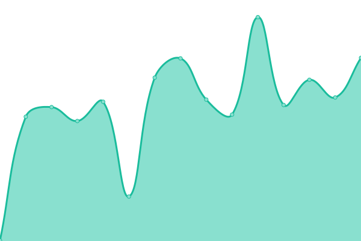
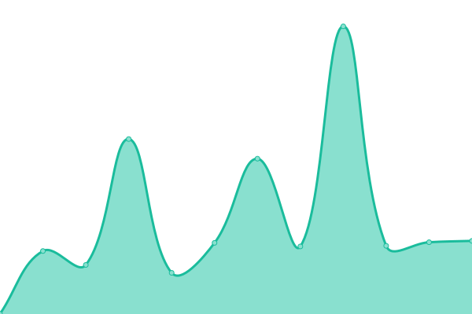

# [📈 Live Status](https://mattgwagner.github.io/ideabloom-uptime): <!--live status--> **🟩 All systems operational**

This repository contains the open-source uptime monitor and status page for [Matt Wagner](https://www.mattgwagner.com), powered by [Upptime](https://github.com/upptime/upptime).

With [Upptime](https://upptime.js.org), you can get your own unlimited and free uptime monitor and status page, powered entirely by a GitHub repository. We use [Issues](https://github.com/mattgwagner/ideabloom-uptime/issues) as incident reports, [Actions](https://github.com/mattgwagner/ideabloom-uptime/actions) as uptime monitors, and [Pages](https://mattgwagner.github.io/ideabloom-uptime) for the status page.

<!--start: status pages-->
<!-- This summary is generated by Upptime (https://github.com/upptime/upptime) -->
<!-- Do not edit this manually, your changes will be overwritten -->
<!-- prettier-ignore -->
| URL | Status | History | Response Time | Uptime |
| --- | ------ | ------- | ------------- | ------ |
|  [Public Website](https://www.ideabloom.io) | 🟩 Up | [public-website.yml](https://github.com/RedLegDev/ideabloom-uptime/commits/HEAD/history/public-website.yml) | 

 206ms
     
 | 

<a href="https://status.ideabloom.io/history/public-website">99.64%</a>
    

|  [IdeaBloom App](https://app.ideabloom.io) | 🟩 Up | [idea-bloom-app.yml](https://github.com/RedLegDev/ideabloom-uptime/commits/HEAD/history/idea-bloom-app.yml) | 

 222ms
     
 | 

<a href="https://status.ideabloom.io/history/idea-bloom-app">99.64%</a>
    

|  [IdeaBloom API](https://api.ideabloom.io/api/HealthFunction) | 🟩 Up | [idea-bloom-api.yml](https://github.com/RedLegDev/ideabloom-uptime/commits/HEAD/history/idea-bloom-api.yml) | 

 1799ms
     
 | 

<a href="https://status.ideabloom.io/history/idea-bloom-api">99.64%</a>
    

<!--end: status pages-->

[**Visit our status website →**](https://mattgwagner.github.io/ideabloom-uptime)

## 📄 License

- Powered by: [Upptime](https://github.com/upptime/upptime)
- Code: [MIT](./LICENSE) © [Anand Chowdhary](https://anandchowdhary.com), supported by [Pabio](https://pabio.com)
- Data in the `./history` directory: [Open Database License](https://opendatacommons.org/licenses/odbl/1-0/)
